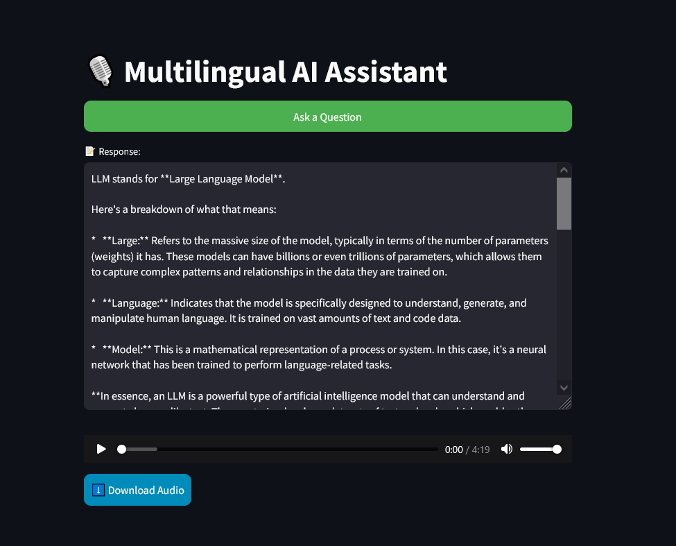

# Multilingual AI Assistant 🎙️

## Overview
The **Multilingual AI Assistant** is a Streamlit-based web application that allows users to ask questions via voice input and receive responses in both text and speech. This project leverages NLP and Text-to-Speech (TTS) technologies to provide an interactive multilingual experience.



## Features
✅ Voice input for user queries 🎤  
✅ AI-powered responses using an LLM 🤖  
✅ Text-to-Speech (TTS) output 🎙️  
✅ Downloadable audio responses 🎵  
✅ Beautiful, responsive UI with enhanced styling ✨  

## Live Demo
Try the live demo here: [Multilingual AI Assistant App](https://abs-futy7-multilingual-ai-voice-assitant-app-09yyyw.streamlit.app/)

## Installation
### Prerequisites
Ensure you have **Python 3.8+** and **pip** installed on your system.

### Clone the Repository
```bash
git clone https://github.com/Abs-Futy7/Multilingual-AI-Voice-Assitant.git
cd Multilingual-AI-Voice-Assitant
```

### Install Dependencies
```bash
pip install -r requirements.txt
```

## Running the Application
```bash
streamlit run app.py
```
This will launch the app in your default web browser.

## Project Structure
```
Multilingual-AI-Voice-Assitant/
│── src/
│   ├── helper.py  # Contains voice input, LLM model, and TTS functions
│── app.py         # Main Streamlit application file
│── requirements.txt
│── README.md
│── UI.png         # Screenshot of the UI
```

## Usage
1. Click the **"Ask a Question"** button.
2. Speak your question into the microphone.
3. The AI processes your input and generates a response.
4. The response is displayed as text and converted to speech.
5. You can **download** the audio response if needed.

## Technologies Used
- **Python** 🐍
- **Streamlit** 🖥️
- **Speech Recognition** 🎤
- **Text-to-Speech (TTS)** 🗣️
- **AI/LLM Model** 🤖

## Contributing
Feel free to contribute to this project by submitting a pull request or reporting issues.

## License
This project is licensed under the **MIT License**.

---
Enjoy using the **Multilingual AI Assistant**! 🚀

